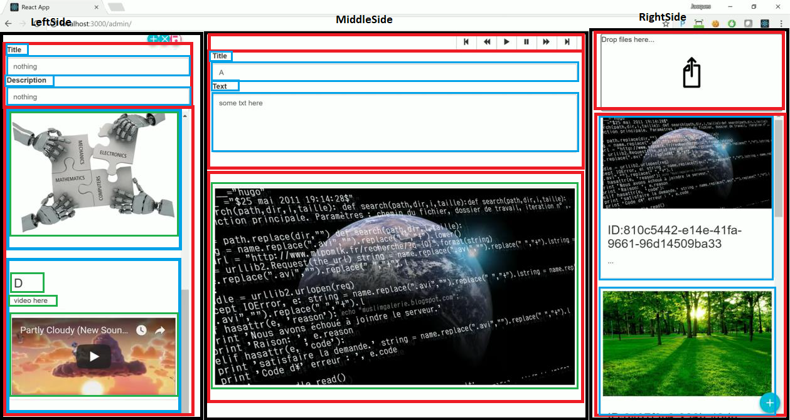

# CPE_ASI
Ce TP a pour objectif de concevoir une application cross technologies permettant d’appréhender la fonction et l’usage de chaque technologie.
# STEP 0 : Création du socle de l’application
# 3.1.2 A quoi sert une telle organisation dans un projet Front ?
Cela permet d'organiser, de découper et de ségmenter les différentes parties nécessaires à notre application. Le dossier components/ par exemple servira de déclaration des différents composants utilisables sur l'app', le dossier lib/ à regrouper (afin de les inclure dans le projet) les librairies externes utiles à l'application, le dossier actions/ regroupera les actions utilisables dans le store et les reducers (dossier reducers/), etc.
# 3.1.3 Lors de la création d’un composant où positionneriez-vous les css spécifiques à ce composant ?
Un fichier CSS est créé dans chaque répertoire associé à un composant. Cela permet d'appeler ce CSS que dans le .js associé à ce composant et de ne pas importer tous les fichiers css dans le App.js. Les CSS associés à des composants non appelés ne seront ainsi pas chargés ce qui sera plus propre.
# 3.2.1 Proposer un découpage en composants de ce projet

# STEP 1 : Création des premiers composants : MainPanel, BrowseContentPanel
# 4.2.1 A quoi sert la extends React.Component ?
Cela permet d'étendre la classe React.Component qui est une classe abtraite permettant de créer et de gérer des composants créés avec ReactJS. Les classes qui étendent React.Component doivent redéfinir la méthode render() donnant la vue qui sera affichée sur l'application.
# 4.2.2 Que représente props ? à quoi sert-il ?
```
The main difference between state and props is that props are immutable. This is why the container component should define the state that can be updated and changed, while the child components should only pass data from the state using props.
```
Les props représentent les données envoyées aux composants enfants, ces données ne sont pas modifiables. Cela sert à échanger des données immuables afin de les réutiliser dans les composants fils.
# 4.2.3 Que représente state ? à quoi sert-il ?
```
State is the place where the data comes from. We should always try to make our state as simple as possible and minimize the number of stateful components. If we have, for example, ten components that need data from the state, we should create one container component that will keep the state for all of them.
```
 Il s'agit de l'initialisation des données utiles au composant et à ses éventuels enfants.
# 4.2.4 Quelle est la fonction principale de render() ?
La méthode render() permet la création et le retour d'éléments à afficher sur le WebBrowser, avec principe d'inclusion de composants enfants éventuels (intéractions, etc.). Cette méthode permet de renvoyer des composants react, des strings et nombres, des booléens, etc. Il examine this.props et this.state afin de les retourner.
